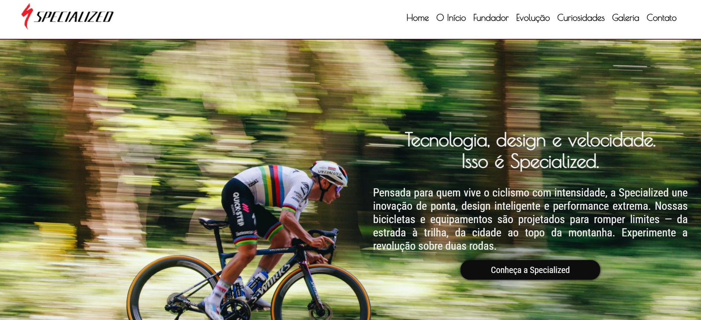

# Specialized History 🚴‍♂️

Projeto desenvolvido para praticar HTML, SASS (SCSS), JavaScript e técnicas de responsividade. Inspirado na história da marca de bicicletas Specialized.

## 📸 Preview

## 🔗 Acesse o Projeto

[👉 Clique aqui para visualizar](https://felipedev90.github.io/a-historia-da-specialized/)

## ⚙️ Tecnologias Utilizadas

- HTML5
- SASS (SCSS) com estrutura modular (BEM)
- JavaScript (menu responsivo, Swiper.js, ScrollReveal, LightGallery)
- Responsividade com media queries e mixins

## ✨ Funcionalidades

- Layout responsivo adaptado para diferentes tamanhos de tela
- Menu hamburguer para dispositivos móveis
- Carrossel de imagens com Swiper.js
- Galeria de fotos com LightGallery.js
- Animações com ScrollReveal.js

## 📁 Estrutura do Projeto

- `/components`: Botões, títulos, parágrafos em SASS
- `/utils`: Variáveis, mixins e configurações globais
- `/image`: Imagens otimizadas em diferentes tamanhos (usando `<picture>`)
- `/js`: Scripts de interação

## 📄 Sobre

Projeto criado como prática de desenvolvimento frontend, focando em organização, boas práticas e responsividade.
